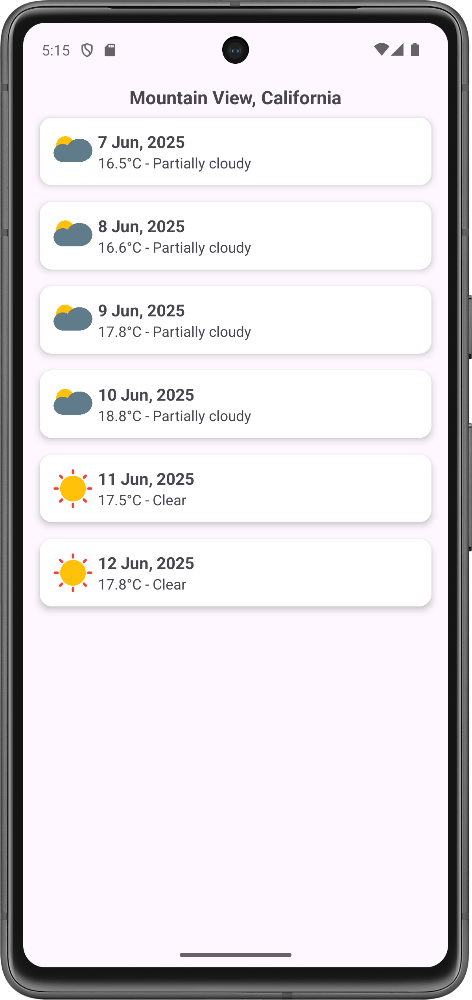
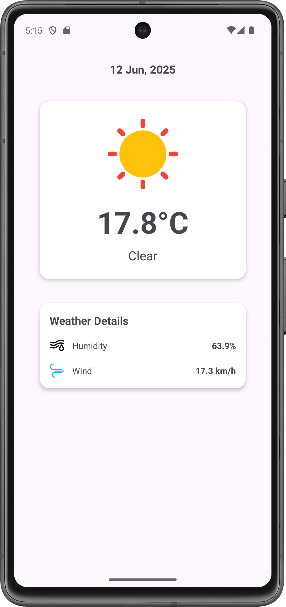
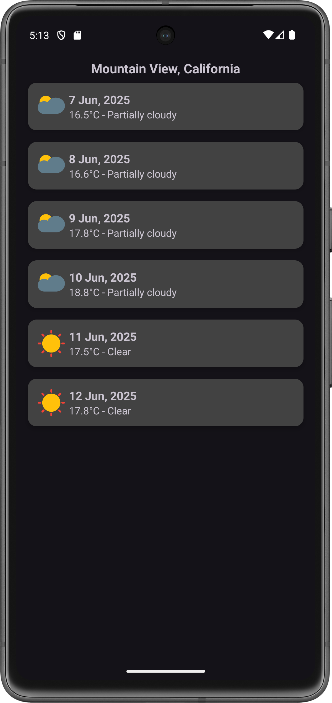
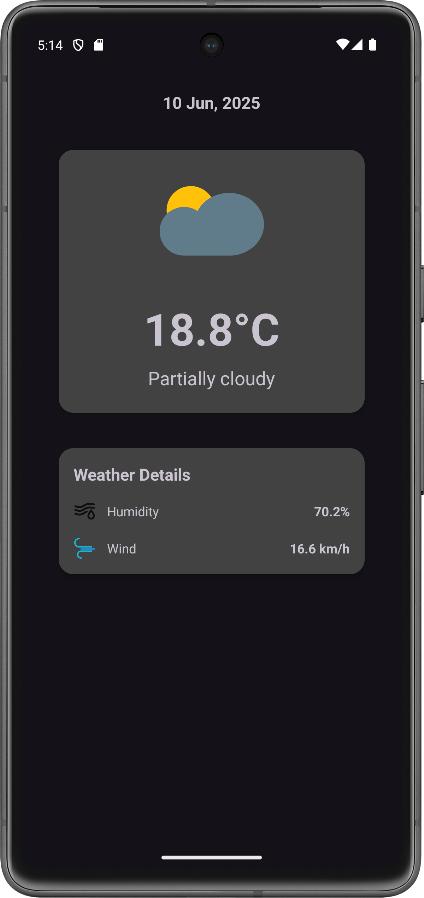

# DailyWeath ☀️🌧️

**DailyWeath** is a weather application developed as part of the **Instabug 2025 Android Internship Task**.

> ⚠️ This app was developed **without any third-party libraries** as required by the task.

## 📱 Tools & Architecture

- **Kotlin**
- **Android Views (XML)**
- **Feature-based Modularization**
- **MVVM Architecture**
- **Manual Dependency Injection** with **Shared ViewModel**
- **SQLiteOpenHelper** for local caching
- **JSON** parsing (no Kotlin Serialization)
- **HttpURLConnection** with a custom lightweight HTTP client (inspired by Ktor)
- **VisualCrossing Weather API**

## 🌤 Features

- Displays **today's weather forecast** and the forecast for the **next 5 days**
- Caches data locally for offline access
- Light and Dark mode support

## 📸 Screenshots

### 🌞 Light Mode

| Forecast Screen | Details Screen |
|-------------|----------------|
|  |  |

### 🌙 Dark Mode

| Forecast Screen | Details Screen |
|-------------|----------------|
|  |  |
